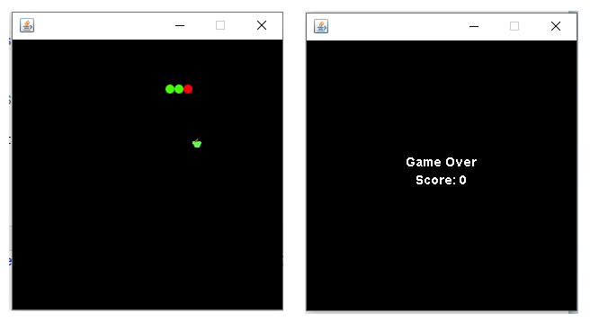

**Snake Game** 
This is a classic Snake Game implemented in Java. The objective of the game is to control a snake and guide it to eat food while avoiding collisions with walls or its own tail. The snake grows longer each time it consumes food, making the game progressively challenging.
  
**How to Play** 
Use the arrow keys (up, down, left, right) to control the movement of the snake.
The snake will move in the direction indicated by the arrow keys.
The snake can't move in the opposite direction of its current movement.
The game ends if the snake collides with a wall or its own tail.
The score increases each time the snake eats food.
Aim to achieve the highest score possible.  
**Dependencies** 
This project requires the following dependencies:
 
Java Development Kit (JDK) version 8 or above. 
Installation and Usage 
**Follow these steps to install and run the Snake Game:**  

Clone or download this repository.

Open a command prompt or terminal window and navigate to the project directory.

Compile the Java source files using the following command:
  
**shell** 
Copy code 
javac SnakeGame.java 
Run the game using the following command: 

shell 
Copy code
java SnakeGame
The game will start, and you can begin playing using the arrow keys.
  
**License**
This Snake Game is released under the MIT License.
  
**Acknowledgments** 
This game is based on the classic Snake Game and was developed as a learning project. Special thanks to the developers of the original Snake Game for the inspiration.
  
**Screenshots** 
Snake Game Screenshot

  
Enjoy playing the Snake Game!
